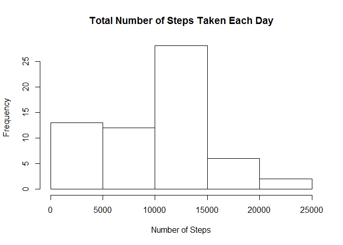
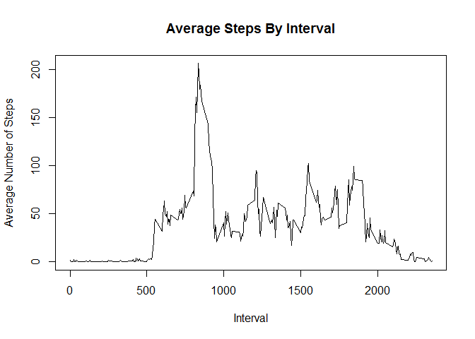
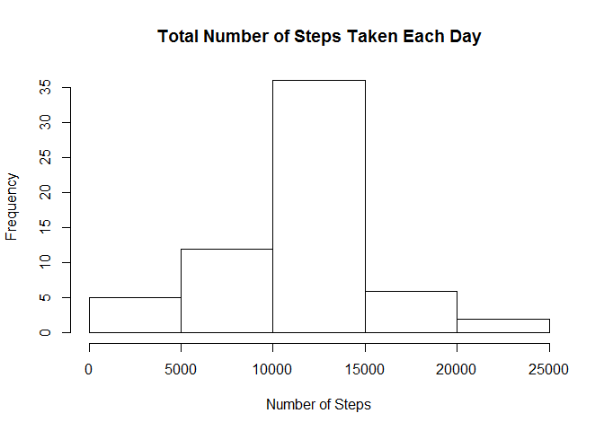

# Reproducible Research: Peer Assessment 1


This assignment makes use of data from a personal activity monitoring device. This device collects data at 5 minute intervals through out the day. The data consists of two months of data from an anonymous individual collected during the months of October and November, 2012 and include the number of steps taken in 5 minute intervals each day.


# Preprocess the Data


```r
activity <- read.csv("activity.csv")

activity$date <- as.Date(as.character(activity$date))
```

# Calculate the Total Number of Steps taken per day


```r
library(plyr)
sumsteps <- ddply(activity, .(date), summarise, sum_steps = sum(steps, na.rm = TRUE))
sumsteps
```

```
##          date sum_steps
## 1  2012-10-01         0
## 2  2012-10-02       126
## 3  2012-10-03     11352
## 4  2012-10-04     12116
## 5  2012-10-05     13294
## 6  2012-10-06     15420
## 7  2012-10-07     11015
## 8  2012-10-08         0
## 9  2012-10-09     12811
## 10 2012-10-10      9900
## 11 2012-10-11     10304
## 12 2012-10-12     17382
## 13 2012-10-13     12426
## 14 2012-10-14     15098
## 15 2012-10-15     10139
## 16 2012-10-16     15084
## 17 2012-10-17     13452
## 18 2012-10-18     10056
## 19 2012-10-19     11829
## 20 2012-10-20     10395
## 21 2012-10-21      8821
## 22 2012-10-22     13460
## 23 2012-10-23      8918
## 24 2012-10-24      8355
## 25 2012-10-25      2492
## 26 2012-10-26      6778
## 27 2012-10-27     10119
## 28 2012-10-28     11458
## 29 2012-10-29      5018
## 30 2012-10-30      9819
## 31 2012-10-31     15414
## 32 2012-11-01         0
## 33 2012-11-02     10600
## 34 2012-11-03     10571
## 35 2012-11-04         0
## 36 2012-11-05     10439
## 37 2012-11-06      8334
## 38 2012-11-07     12883
## 39 2012-11-08      3219
## 40 2012-11-09         0
## 41 2012-11-10         0
## 42 2012-11-11     12608
## 43 2012-11-12     10765
## 44 2012-11-13      7336
## 45 2012-11-14         0
## 46 2012-11-15        41
## 47 2012-11-16      5441
## 48 2012-11-17     14339
## 49 2012-11-18     15110
## 50 2012-11-19      8841
## 51 2012-11-20      4472
## 52 2012-11-21     12787
## 53 2012-11-22     20427
## 54 2012-11-23     21194
## 55 2012-11-24     14478
## 56 2012-11-25     11834
## 57 2012-11-26     11162
## 58 2012-11-27     13646
## 59 2012-11-28     10183
## 60 2012-11-29      7047
## 61 2012-11-30         0
```

# Make a histogram of the total number of steps taken each day


```r
hist(sumsteps$sum_steps, main = paste("Total Number of Steps Taken Each Day"), xlab = c("Number of Steps"))
```

 

# Caluculate the mean and median of the total number of steps taken each day


```r
meansteps <- mean(sumsteps$sum_steps)
meansteps
```

```
## [1] 9354.23
```

```r
mediansteps <- median(sumsteps$sum_steps)
mediansteps
```

```
## [1] 10395
```

The mean number of steps taken per day is 9354.23, while the median number of steps taken is 10395.

# Make a time series plot of the 5 minute interval and the average number of steps taken, averaged across all days


```r
avgsteps <- ddply(activity, .(interval), summarise, avg_steps = mean(steps, na.rm = TRUE))
head(avgsteps, 10)
```

```
##    interval avg_steps
## 1         0 1.7169811
## 2         5 0.3396226
## 3        10 0.1320755
## 4        15 0.1509434
## 5        20 0.0754717
## 6        25 2.0943396
## 7        30 0.5283019
## 8        35 0.8679245
## 9        40 0.0000000
## 10       45 1.4716981
```

```r
ts <- plot(avgsteps, type = "l", main = paste("Average Steps By Interval"), ylab = c("Average Number of Steps"), xlab = c("Interval"))
```

 

# Which 5min interval on average across all the days in the dataset contains the maximum number of steps?


```r
maxint <- which(avgsteps == max(avgsteps$avg_steps))
maxint
```

```
## [1] 392
```

The interval which contains the maximum number of steps on average is 392.

# Calculate and report the total number of missing values in the data set


```r
missingno <- count(activity$steps == NA)
missingno
```

```
##    x  freq
## 1 NA 17568
```

This dataset has 17,568 missing values.

# Strategy for inputing missing values

Use mean per 5min interval to fill in missing values. This mean is calculated over all observered days in this dataset. The NAs are then replaced by the corresponding interval's mean over all observations of that interval. 


```r
a <- as.data.frame(cbind(activity$steps, avgsteps$avg_steps))
a$V1[is.na(a$V1)] <- a$V2[is.na(a$V1)]
subdata <- subset(activity, select = c(date, interval))
newactivity <- cbind(a$V1, subdata)
newactivity <- rename(newactivity, c("a$V1" = "steps"))
head(newactivity, 10)
```

```
##        steps       date interval
## 1  1.7169811 2012-10-01        0
## 2  0.3396226 2012-10-01        5
## 3  0.1320755 2012-10-01       10
## 4  0.1509434 2012-10-01       15
## 5  0.0754717 2012-10-01       20
## 6  2.0943396 2012-10-01       25
## 7  0.5283019 2012-10-01       30
## 8  0.8679245 2012-10-01       35
## 9  0.0000000 2012-10-01       40
## 10 1.4716981 2012-10-01       45
```

# Make a histogram of the total number of steps taken each day


```r
sumsteps1 <- ddply(newactivity, .(date), summarise, sum_steps = sum(steps, na.rm = TRUE))
hist(sumsteps1$sum_steps, main = paste("Total Number of Steps Taken Each Day"), xlab = c("Number of Steps"))
```

 

# Caluculate and report the mean and median of the total number of steps taken each day


```r
meansteps1 <- mean(sumsteps1$sum_steps)
meansteps1
```

```
## [1] 10766.19
```

```r
mediansteps1 <- median(sumsteps1$sum_steps)
mediansteps1
```

```
## [1] 10766.19
```

The mean, with inputed missing values, of the total number of steps taken each day is 10,766.19. Compared with the previously calculated mean, this represents a difference of 1411.96. Over time, this is a significant difference in steps taken per day and conversely, with calories burned. In the short run, however, this does not make a significant change in the measurements of the data. 

The median, with inputed missing values, of the total number of steps taken each day is 10,766.19.

# Convert date to weekdays
# Create a new factor variable with two levels : weekday and weekend


```r
newactivity$day <- weekdays(newactivity$date)

for (i in 1:nrow(newactivity)) {
    
    if(newactivity[i,]$day %in% c("Saturday", "Sunday")) {
        newactivity[i,]$day <- "weekend"
    }
    
    else {
        newactivity[i,]$day <- "weekday"
    }
}
head(newactivity, 10)
```

```
##        steps       date interval     day
## 1  1.7169811 2012-10-01        0 weekday
## 2  0.3396226 2012-10-01        5 weekday
## 3  0.1320755 2012-10-01       10 weekday
## 4  0.1509434 2012-10-01       15 weekday
## 5  0.0754717 2012-10-01       20 weekday
## 6  2.0943396 2012-10-01       25 weekday
## 7  0.5283019 2012-10-01       30 weekday
## 8  0.8679245 2012-10-01       35 weekday
## 9  0.0000000 2012-10-01       40 weekday
## 10 1.4716981 2012-10-01       45 weekday
```

```r
tail(newactivity, 10)
```

```
##           steps       date interval     day
## 17559 0.0000000 2012-11-30     2310 weekday
## 17560 0.8301887 2012-11-30     2315 weekday
## 17561 0.9622642 2012-11-30     2320 weekday
## 17562 1.5849057 2012-11-30     2325 weekday
## 17563 2.6037736 2012-11-30     2330 weekday
## 17564 4.6981132 2012-11-30     2335 weekday
## 17565 3.3018868 2012-11-30     2340 weekday
## 17566 0.6415094 2012-11-30     2345 weekday
## 17567 0.2264151 2012-11-30     2350 weekday
## 17568 1.0754717 2012-11-30     2355 weekday
```

# Make a panel plot containing a time series plot of the 5-minute interval and the average number of steps taken, averaged across all weekday days or weekend days.


```r
weekday <- subset(newactivity, newactivity$day == "weekday")
weekend <- subset(newactivity, newactivity$day == "weekend")

avgsteps1 <- ddply(weekday, .(interval), summarise, avg_steps = mean(steps))
avgsteps2 <- ddply(weekend, .(interval), summarise, avg_steps = mean(steps))

par(mfrow = c(2, 1))
plot(avgsteps1, type = "l", main = paste("Weekday"), xlab = c("Interval"), ylab = c("Number of Steps"))
plot(avgsteps2, type = "l", main = paste("Weekend"), xlab = c("Interval"), ylab = c("Number of Steps"))
```

 

There is a significant difference in activity between weekdays and weekends. After a comparable initial spike every morning around the same time, on weekdays, activity is fairly low, as one would expect from a person with a desk job. On weekends, however, there is a much higher daily level of activity.
